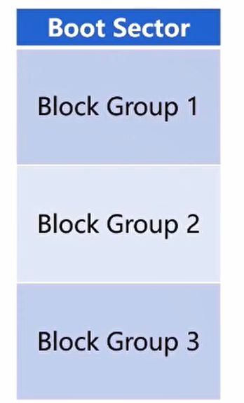
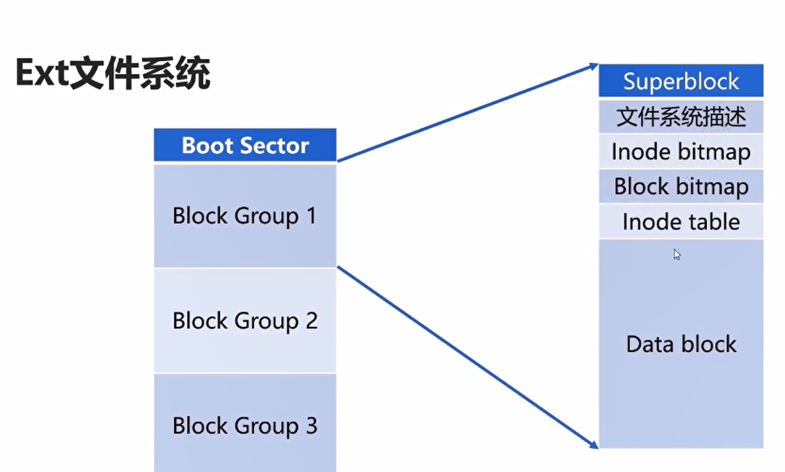

# linux的文件系统

## 文件系统概览
常见的文件系统有：
1. FAT(File Allocation Table)
2. NTFS(New Technology File System)
3. EXT2/3/4(拓展文件系统)

### 1.FAT(File Allocation  Table)
- 早期微软Dos/Windows使用的文件系统

- 使用一张表保存盘块的信息
### 2. NTFS(New Technology File System)

- WindowsNT环境的文件系统
- NTFS对FAT进行了改造，取代了旧的文件系统
- 也可以被Linux所识别

### 3. EXT2/3/4(拓展文件系统)
- Linux的文件系统
- 数值表示第几代

## EXT文件系统
当选择EXT文件系统时，硬盘的逻辑结构如下：

Boot Sector：启动扇区，安装开机管理程序

Block Group:块组，==存储数据==的实际位置

### Block Group展开

#### Inode table
存放文件Inode的地方

每个文件（目录）都有一个Inode

是每一个文件（目录）的索引节点

Inode节点的编号才是文件的唯一标记，名字并不是!
##### Inode

存放每个文件的原信息，包括：
1. 文件类型
2. 文件权限
3. 文件物理地址
4. 文件长度
5. 文件链接计数
6. 存储实际
7. 索引节点编号
8. 文件正态
9. 访问计数
10. 链接指针

==注意==：文件名不是存放在Inode节点上的，而是存放在目录的Inode节点。这样做的好处是列出目录文件时候无需加载文件的Inode

#### Inode bitmap 

- Inode的位置图
- 记录已分配的Inode和未分配的Inode

当一个文件系统初始化的时候，Inode数目就已经固定了。

#### Data block
存放文件内容的地方
- 每一个block都有唯一的编号
- 文件的block记录在文件的Inode上

#### Block bitmap
功能与Inode bitmap类似
- 记录Data blockd的使用情况

#### Superblock
1024B
记录整个文件系统相关信息的地方
- Block和Inode的使用情况
- 时间信息、控制信息