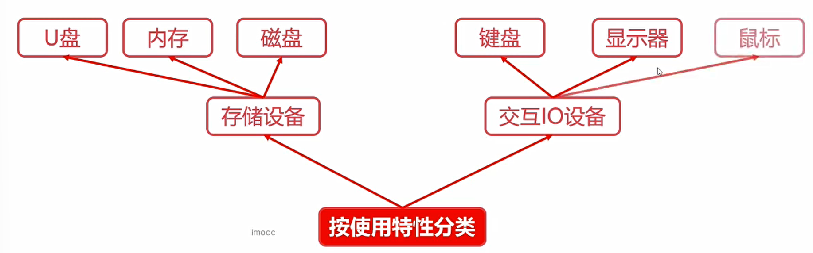
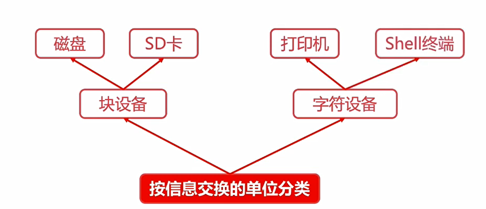
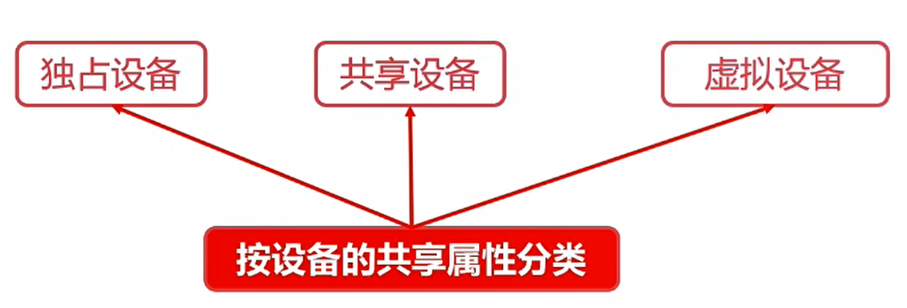
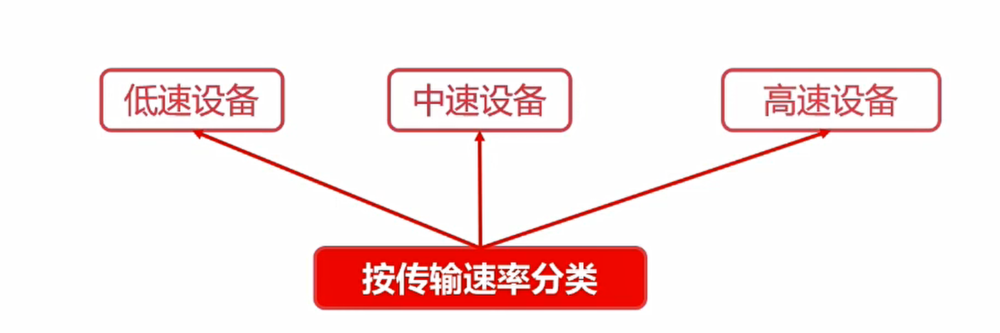
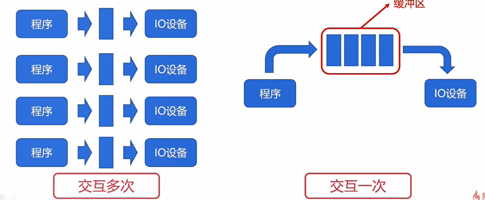
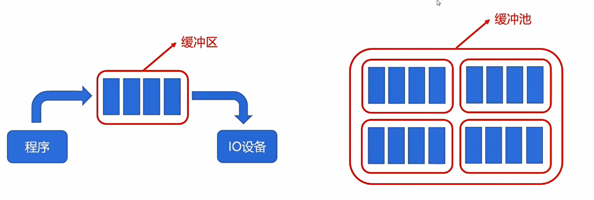
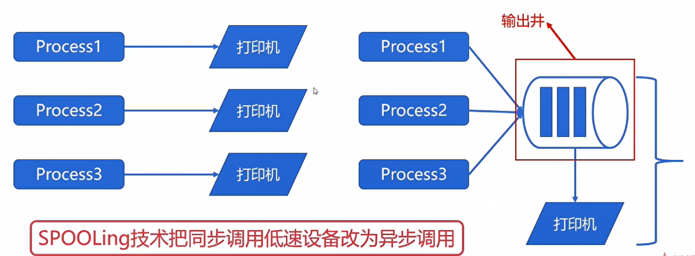

# 操作系统的设备管理

## 广义的IO设备
对CPU而言，凡是对CPU进行数据输入的都是输入设备

对CPU而言，凡是对CPU进行数据输出的都是输出设备

接下来对广义IO设备进行分类

### 按使用特性分类

### 按信息交换的得分类

- 块设备是以数据块为基本单位行数据传输，==以B作为标识==
- 字符设备是以字符为基本单位进行数据传输，==以C作为标识==(char)

### 按数据的共享属性分类

### 按传输速率分类
、

## IO设备的缓冲区
==CPU与IO设备的速率不匹配==
- 减少CPU处理IO请求的频率
- 提高CPU与IO设备之间的并行性

- 专用缓冲区只适用于特定的IO进程
- 当这样的IO进程比较多时，对内存的消耗也很大
- 因此操作系统划出可供多个进程使用的公共缓冲区，这称为缓冲池。

### 缓冲池的工作原理

程序要执行从缓冲池里取缓冲区，使用完成之后再归还。
==进程是程序的一次执行==

## SPOOLING 技术
操作系统设备管理的一项非常重要的技术
- SPOOLing技术是关于慢速设备如何与计算机主机交换信息的一种技术
- 本质是利用高速共享设备将低速独享设备模拟为高速的共享设备。
- 逻辑上，系统为每一个用户都分配了一台高速的独享设备。

这是一个虚拟设备的技术
### 例子
三个进程均需要的速度很低的打印机

打印机不会直接分配给某一个进程。

磁盘会分配一个存储区，各个进程的输出会形成一个输出队列（IO请求表）。然后Spoling技术的进程控制打印机的进程依次将磁盘里面的数据进行打印

- 在输入输出之间增加了排队转储环节（输入井、输出井）
- SPOOLING负责输入（出）井与低速设备之间的调度。
- 逻辑上，进程直接与高速设备交互，减少了进程的等待时间