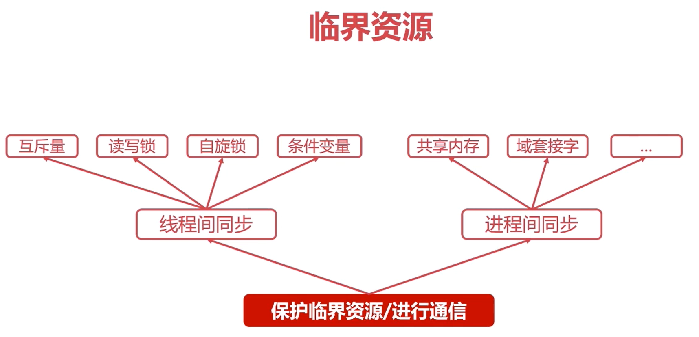
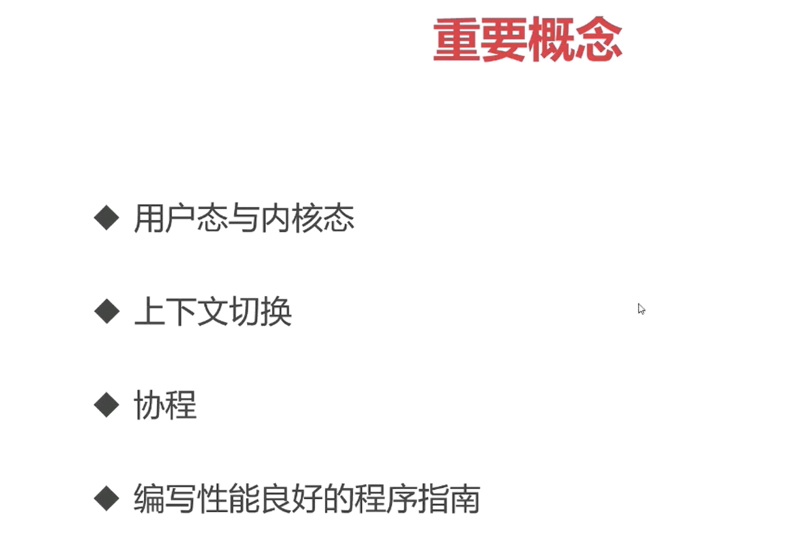
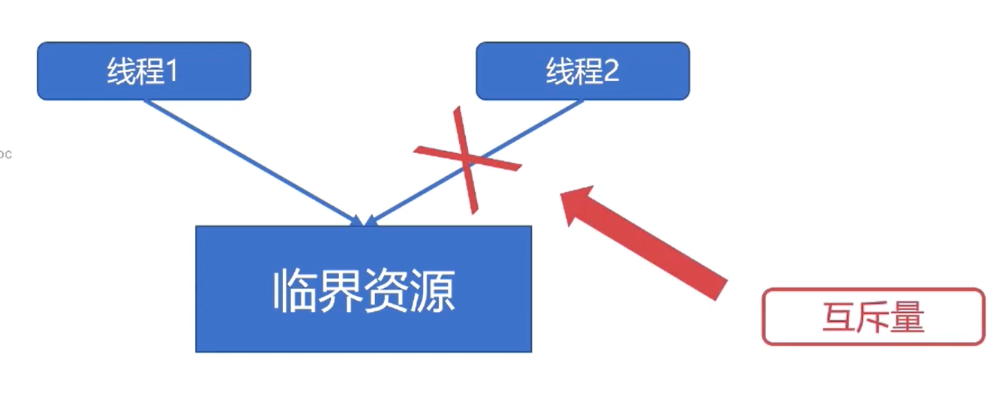
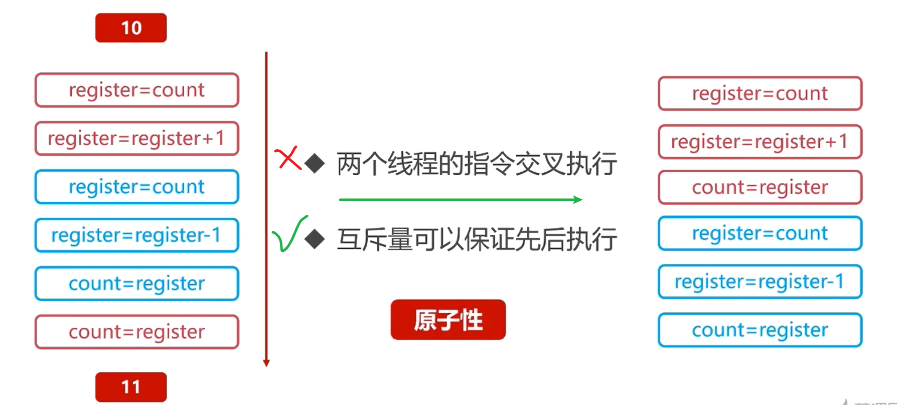
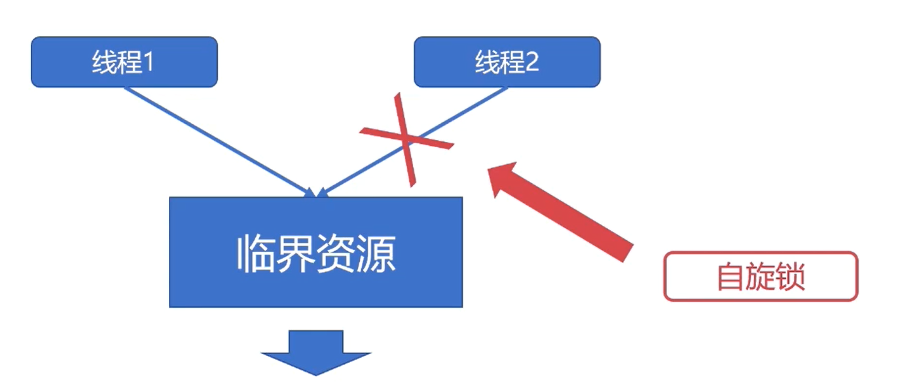
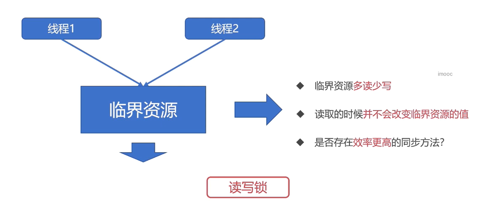
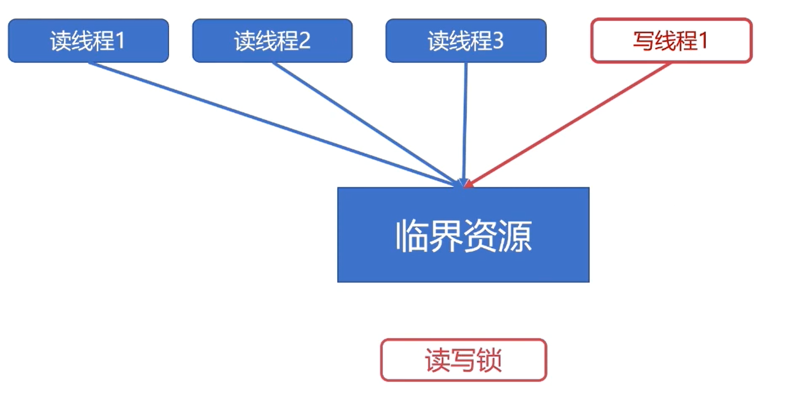

# 线程同步

## 1.互斥锁
加锁，隔离级别为串行！

保证关键指令的原子性
、

- 互斥量是最简单的进程同步的方法

### API
- 操作系统提供了互斥量的API
- 开发者可以直接使用API完成资源的加锁、解锁操作

不同的语言互斥锁的API不同
- pthread_mutex_lock
- pthread_mutex_unlock

## 2.自旋锁

特点：
- 自旋锁是一种多线程同步的变量
- 使用自旋锁会反复检查锁变量是否可用，独占了CUP的一个核，这是于互斥锁最大的不同。
- 死循环等待所被释放

优点：
- 自旋锁避免了进程或者线程上下文切换的开销
- 操作系统内部很多地方使用的是自旋锁

缺点：
- 自旋锁不会让出CPU,是一种==忙等待==状态。
- 自旋锁不适合在单核CPU使用

### API
- pthread_spinlock_t

## 读写锁

对上面两个锁进行改进，对自旋锁进行改进。
- 读写锁是一种特殊的自旋锁
- 允许多个读者同时访问资源以提高读性能。
- 对于写操作是互斥的

### API
- pthread_rwlock_t
- pthread_rwlock_rdlock(读锁)
- pthread_rwlock_wrlock(写锁)

## 条件变量
- 条件变量是一种相对复杂的线程同步的方法
- 条件变量允许线程睡眠，直到满足某种条件
- 当满足条件时，可以向该线程发送信号，通知唤醒。

举例：
- 缓冲区<=0的时候，不允许消费者消费，消费者必须等待。
- 缓冲区满时，不允许生产者往缓冲区生产，生产者必须等待

- 当生产者生产一个产品时，唤醒可能等待的消费者
- 当消费者消费一个产品时，唤醒可能的生产者

### API
- pthread_cond_t
- pthread_cond_wait(等待条件被满足)
- pthread_cond_notify(等待条件被唤醒)

