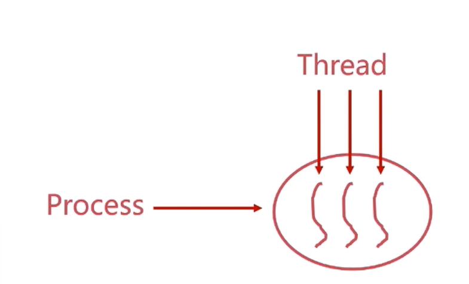
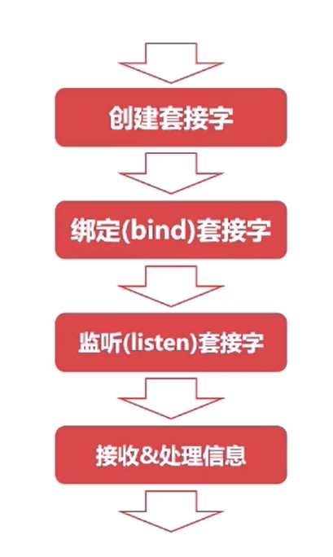

# 进程同步

## 使用fork系统调用创建进程
- fork系统调用是由于创建进程的
- fork创建的进程初始化状态与父进程一样。
- 系统会为fork进程分配新的资源

## 使用
- fork系统调用无参数
- fork会返回两次，分别返回子进程id和0 ==重要特性==
- 返回子进程的是父进程，返回0的是子进程

## 共享内存
- 共享内存是高性能后台开发中最常使用的进程同步方式
- 进程的线程共享进程资源

线程之间需要通信，线程需要同步一些进程的状态。

一个操作系统里面可能有一个或多个进程，共享计算机的资源（内存、磁盘等待）

所以我们需要进程的同步

### 回忆 操作系统的进程管理
- 每个进程都有自己的进程空间，并且进程空间通过页表（段页式存储管理）与实际的物理内存建立起映射

- 不同进程的进程空间是互不干扰的，相互独立的。
- 在某种程度上，多进程是个头使用物理内存的
- 由于操作系统的进程管理，进程间的内存空间是独立的。
- 这样保证了进程运行的安全性

进程默认不能访问进程空间之外的内存空间的，但是通过共享内存可以使得不同的进程对同一片物理内存进行读和写。

### 共享内存详说
- 共享内存允许不相关的进程访问同一片物理内存。
- 共享内存是两个进程之间共享和传递数据最快的方式

- 缺点：共享内存==未提供同步机制==，需要借助其他机制管理访问

过程:

1. 向操作系统申请共享内存
2. 把共享内存连接到进程空间，链接之后，进程才可以通过页表来访问共享内存。
3. 使用共享内存，对共享内存读或者写来传递一些信息
4. 把共享内存脱离进程空间并且删除掉

共享内存的例子

## Unix域套接字
- 域套接字是一种高级的进程间通信的方法，提供了单机==简单可靠==的进程通信同步的方法
- 只能在单机使用，不能跨机器使用
- Unix域套接字可以由于同一种机器多个进程间通信  

- 套接字（socket）原是网络通信中使用的术语
- Unix系统提供的域套接字提供了网络套接字类似的功能

- 通过域套接字是可以把服务端和客户端联系起来的
- 相比于共享内存，不需要去维护多个进程去读取这个空间的机制的，多了一些可靠性
### 使用的方法

#### 服务端

#### 客户端

#### 例子